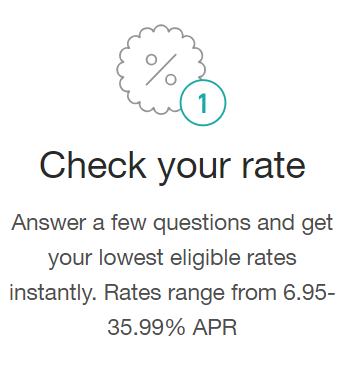

```{r global_options, echo=FALSE}
knitr::opts_chunk$set(fig.width=7,
                      fig.height=4,
                      echo=FALSE,
                      warning=FALSE,
                      message=FALSE)
```

```{r echo=FALSE, message=FALSE, warning=FALSE, packages}
# The other parameters for "message" and "warning" should also be set to FALSE
# for other code chunks once you have verified that each plot comes out as you
# want it to. This will clean up the flow of your report.

library(ggplot2)
library(dplyr) # for group_by
library(gridExtra) # for grid.arrange
library(GGally) # for ggpairs
```


```{r echo=FALSE, Load_the_Data}
# Load the Data
loans <- read.csv("prosperLoanData.csv", sep = ",")
```


This Exploratory Data Analysis (EDA) project is part of the curriculum of the Data Analysis Nano Degree of Udacity. Prosper Funding LLC is a platform for peer-to-peer lending in the United States. Since its foundation in 2015 it has facilitated US$13 billion in loans to over 860,000 people, according to its [website](https://www.prosper.com/about).

Borrowers get fixed-rate loans between US$ 2,000 and US$ 40,000 in fixed terms of 3 or 5 years. The money enters their bank accounts after only a few days of accepting a loan offer, and prepayments are not penalized. 

Peer-to-peer loans refers to the lack of a financial intermediary in the operation. Instead, a lender and a borrower meet at a marketplace (in this case Prosper) and agree to the loan terms. This model was very revolutionary in 2005 when the company was created, and has attracted several competitors. Borrowers usually can find loans they could not find in the financial sector, and investors have a high-return in a relatively low-risk investment mechanism. 

The dataset was provided directly by Udacity and can be obtained [here](https://www.google.com/url?q=https://s3.amazonaws.com/udacity-hosted-downloads/ud651/prosperLoanData.csv&sa=D&ust=1544380084735000). It has 81 variables, which obliges to focus this analysis on only a few of them. A data dictionary can be read [here](https://docs.google.com/spreadsheets/d/1gDyi_L4UvIrLTEC6Wri5nbaMmkGmLQBk-Yx3z0XDEtI/edit#gid=0).


**Some inicial questions that pop-up immediately are**:

- What are some characteristics of prosper loans? (term, amounts, default rates)
- What are characteristics of borrowers/lenders in the platform? (geography, demographics, employment)
- What variables are related to each other? 
- What factors can lead to defaulting a loan?

We will see if we can answer some of these questions by performing an Exploratory Data Analysis in three phases:
1. Univariate Analysis
2. Bivariate Analysis
3. Multivariate Analysis


# Univariate Plots Section
In this first phase, we will get acquainted with the dataset, explore some of its variables independently and identify some interesting aspects that can further guide the analysis. This process needs to be done hand-in-hand with the data dictionary to be sure that we are interpreting correctly the different variables. 


## Counting the number of variables and observations
```{r echo=FALSE, Dimensions}
loans <- loans%>%
  select(-ListingKey, -ListingNumber, -LoanKey, -GroupKey)

dim(loans)
```

**Notes**: it is a large dataset with almost 114k listings and 81 variables. I remove three of them to make the size of the dataset smaller and help run code faster. 

A listing is a unique observation, which depicts one borrowing process from the application until its closing. A listing is closed when it's status is either cancelled, completed, charged off or defaulted. Defaulted listings are those that have payments due for over 120 days, but that are still in the recovery process. Charged-off listings are defaulted listings that have been already written-off and removed from accounting (accounts receivable). 


## Diverse counts for categorical variables
```{r}
loans%>%
  count(LoanStatus, sort = TRUE)
```

```{r}
loans%>%
  count(Term, sort = TRUE)
```
```{r}
loans%>%
  count(ProsperRating..numeric.)
```
```{r}
loans%>%
  count(ProsperScore)
```

**Notes**: Most of the listings have the status "current", which is a good indication of a growing business. Most have a term of three years. Three or five years seem like the two main options for borrowing with Prosper. "Prosper Rating" (7 = best) is allocated considering credit scores to every listing by creation time, whereas a "Prosper Score" is a custom score (1 = worst, 10 = best) based on historical Prosper Data.  

## Range of dates for creation of listings in the dataset

```{r  dates_range}
# Convert the ListingCreationDate field to time (it is currently a factor)
loans$ListingCreationDate <- as.POSIXct(loans$ListingCreationDate)

range(loans$ListingCreationDate)
```


## Distribution of listings by status

```{r echo=FALSE, status}
ggplot(aes(x = LoanStatus), data = loans)+
  geom_histogram(stat = "count", fill = "orange")+
  theme(axis.text.x  = element_text(angle=45, vjust=0.5, size=10))
```

**Notes**: Most of the listings have "current" as status (roughly 55,000), followed by "completed" (at dataset generation). The number of "past due" listings seems very low. However, roughly 12,000 charged-off loans is a considerable amount of listings that are deemed not-recoverable.

## How much do people borrow in Prosper?
```{r loan_amount, echo=FALSE}

ggplot(aes(x = LoanOriginalAmount), d = loans)+
  geom_histogram(binwidth = 500)+
  scale_x_continuous(breaks = seq(0, 30000, 5000))+
  geom_vline(aes(xintercept=median(LoanOriginalAmount, na.rm=T)),
               color="red", linetype="dashed", size=1)

```

**Notes**: The amount borrowed with Prosper Loans is relatively low, with the most frequent value at around US$ 3500 and the median at around US$6000


## Evaluating the "past due" status of loans

```{r echo=FALSE, past_due}
# A new subset to explore listings with Status "Past Due"
past_status <- filter(loans, grepl("Past", LoanStatus, fixed = TRUE))

# Check the most recent listing with a "Past Due" status
#range(past_status$ListingCreationDate, na.rm=TRUE)

# A frequency polygon will help see whether the "Past Due" status is and old feature or not
ggplot(aes(x = ListingCreationDate), data = past_status)+
  geom_freqpoly()

```

**Notes**: It seems the past_due status is not an old function, and that the seemingly low proportion of loans with "past due" status is accurate.


## Distribution of listing by Status, facet by Term

```{r echo=FALSE, status_term, fig.width=4, fig.height=7}
ggplot(aes(x = LoanStatus), data = loans)+
  geom_histogram(stat = "count")+
  theme(axis.text.x  = element_text(angle=90, vjust=0.5, size=8))+
  facet_wrap(~Term, ncol = 1)
```

**Notes**: We see that 12-month loans existed in the past and there are no current loans with that term. Most loans have a term of 36 months, but the ratio of current vs completed loans is larger for 60 month loans. This could mean that demand for longer loans grows faster, or that the company and/or investors prefer longer terms. 

## Distribution of listings by Prosper Score 
The mean is displayed with the red dashed line

```{r echo=FALSE, ProsperScore}
ggplot(aes(x = ProsperScore), data = subset(loans, ProsperScore < 11))+
  geom_histogram(stat = "count", fill = "orange")+
  scale_x_continuous(breaks = seq(1,10,1))+
    geom_vline(aes(xintercept=mean(ProsperScore, na.rm=T)),
               color="red", linetype="dashed", size=1)
```

**Notes**: The Prosper Score rates 10 as lowest risk and 1 as highest. This distribution suggests a rather good risk distribution of the listings, with most of them displaying a score of between 4 and 8. 

I subsetted the data to remove values with score 11, which is a value not described in the data dictionary, and which might correspond to listings before 2009 when the Prosper Score was introduced.

## Distribution by Loan Category

```{r echo=FALSE, loan_category}
ggplot(aes(x = ListingCategory..numeric.), data = loans)+
  geom_histogram(summary = "count",
                 color = "black",
                 fill = "orange",
                 binwidth = 1)+
  scale_x_continuous(breaks = seq(0, 20, 1))

```

**Notes**: The vast majority of the listings fall under the category "1", which according to the data dictionary corresponds to Debt Consolidation. This is a category that the borrower chooses when applying for a loan. "0" means the information is not available, and "7" corresponds to "other", completing the three most frequent categories. "2" and "3" correspond to Home Improvement and Business, respectively. 

## Value of loans by Borrower's state

```{r echo=FALSE, geographic_distribution}

# Data frame summarizing loans by borrower's state
loans_by_state <- loans%>%
  group_by(BorrowerState)%>%
  summarise(loan_sum = sum(LoanOriginalAmount),
            n = n())%>%
  arrange(desc(loan_sum))

# bar chart with ordered columns
ggplot(aes(x = reorder(BorrowerState, -loan_sum), y = loan_sum), data = loans_by_state)+
         geom_col(fill = 'orange')+
  theme(axis.text.x  = element_text(angle=90, vjust=0.5, size=8))+
  scale_y_continuous(labels = scales::comma)
```

**Notes**: California is Prosper Loans largest market, followed distantly by Texas, New York, Florida and Illinois. An Internet search shows that these States, in the same exact order, are the U.S. largest by population. Prosper has offices in San Francisco (CA), and Phoenix (TX). Further expansion into the next three largest states could make sense in the expansion strategy of the company.

## Distribution by APR and Interest Rate 

```{r echo=FALSE, apr_rate }
p1 <- ggplot(aes(x = BorrowerAPR), data = loans)+
  geom_histogram(fill = "lightgreen", binwidth = 0.01)+
  scale_x_continuous(breaks = seq(0, 4, 0.05))+
   theme(axis.text.x  = element_text(angle=90, vjust=0.5, size=8))+
   geom_vline(aes(xintercept=mean(BorrowerAPR, na.rm=T)),
               color="red", linetype="dashed", size=1)

 p2 <- ggplot(aes(x = BorrowerRate), data = loans)+
  geom_histogram(fill = "lightgreen", binwidth = 0.01)+
  scale_x_continuous(breaks = seq(0, 4, 0.05))+
   theme(axis.text.x  = element_text(angle=90, vjust=0.5, size=8))+
   geom_vline(aes(xintercept=mean(BorrowerRate, na.rm=T)),
               color="red", linetype="dashed", size=1)
 
 p3 <- ggplot(aes(x = BorrowerAPR), data = loans)+
  geom_histogram(fill = "lightgreen", binwidth = 0.01)+
   coord_cartesian (xlim = c(0.12, 0.36))+
  scale_x_continuous(breaks = seq(0.1, 0.37, 0.03))+
   theme(axis.text.x  = element_text(angle=90, vjust=0.5, size=8))+
   geom_vline(aes(xintercept=mean(BorrowerAPR, na.rm=T)),
               color="red", linetype="dashed", size=1)

 p4 <- ggplot(aes(x = BorrowerRate), data = loans)+
  geom_histogram(fill = "lightgreen", binwidth = 0.01)+
  coord_cartesian (xlim = c(0.12, 0.36))+
  scale_x_continuous(breaks = seq(0.1, 0.37, 0.03))+
   theme(axis.text.x  = element_text(angle=90, vjust=0.5, size=8))+
    geom_vline(aes(xintercept=mean(BorrowerRate, na.rm=T)),
               color="red", linetype="dashed", size=1)
 
grid.arrange(p1, p2, p3, p4, ncol=2)


```

**Notes**: The Borrower's Annual Percentage Rate (APR) for the loan includes the interest rate plus other costs associated to the loan. This explain the higher Borrower Rate's mean. It is mandatory for lenders to make this information public to allow for better comparison.

These two histograms indicate that APR follows a very similar distribution as the interest rate, meaning that the fees and other costs are distributed evenly.I will focus on APR for further analysis, because it is a better description of the actual price a borrower pays for the loan received. 

We see a marked peak around a rate of 35%, although the bulk of the listings have a rate of between 12% and 25%. This seems accurate, given Prosper's claim on its website:



# Distribution by monthly payments

```{r echo=FALSE, monthly_payment }
ggplot(aes(x = MonthlyLoanPayment), data = loans)+
  geom_histogram(binwidth = 25, fill = "lightgreen", color = "black")+
  coord_cartesian(xlim = c(0, quantile(loans$MonthlyLoanPayment, 0.99)))+
  scale_x_continuous(breaks = seq(0,1000,50))+
    geom_vline(aes(xintercept=mean(MonthlyLoanPayment, na.rm=T)),
               color="red", linetype="dashed", size=1)
```

**Notes**: Most Borrowers at Prosper pay between US$ 50 and uS$ 400 per month for their loans, and the mean is around US$ 275 Let's see a five number summary for this distribution in the next chart.  

# Explore descriptive statistics for monthly payments by Prosper Score


```{r factorise, include=FALSE }
#Transform the Prosper Score into a factor, to compare it in boxplots
loans$ProsperScore <- factor(loans$ProsperScore)
levels(loans$ProsperScore)
```

```{r echo=FALSE, monthly_5number_summary}
#plot five number summary of monthly payments for the different categories of Score
ggplot(aes(x = ProsperScore, y = MonthlyLoanPayment),
       data = subset(loans, ProsperScore != 11))+
  geom_boxplot(color = 'black', fill = '#F79240')+
  coord_cartesian(ylim = c(0, quantile(loans$MonthlyLoanPayment, 0.9)))+
  scale_y_continuous(breaks = seq(0,500,100))

```

**Notes**: We can see here that listings with the worse score (10) correspond to a larger interquantile range (IQR) of monthly loan payment value. The median monthly payment for listings with more risk is also notably higher, which corresponds to how the financial market works. 

# Comparison of Loans Originated by year

```{r echo=FALSE, loans_year}
# Create an additional variable with the loan origination year
loans$LoanYear <- format(as.Date(loans$LoanOriginationDate),"%Y")

# Plot the new variable
ggplot(aes(x = LoanYear), data = loans)+
  geom_histogram(stat = "count", fill = "darkred")+
  theme(axis.text.x  = element_text(angle=90, vjust=0.5, size=8))
```

**Notes**: It is immediately clear the effect that the 2008 financial crisis and the subsequent recession had in the number of loans initiated by Prosper. The number of loans grew again in 2011 and did more significantly so into 2013. The data set is from the first half of 2014, which explains the lower number of credits displayed for that year.

# Number of Investors

```{r echo=FALSE, investors }
p1 <- ggplot(aes(x = Investors), data = loans)+
  geom_histogram(binwidth = 1)+
  coord_cartesian(xlim = c(0, quantile(loans$Investors, 0.98)))+
  scale_x_continuous(breaks = seq(0, 400, 50))

p2 <- ggplot(aes(x = Investors), data = loans)+
  geom_histogram(binwidth = 1)+
  coord_cartesian(xlim = c(0, quantile(loans$Investors, 0.4)))+
  scale_x_continuous(breaks = seq(0, 400, 2))

grid.arrange(p1, p2, ncol = 2)


```

**Notes**: In a peer-to-peer scheme, many investors can contribute to one same loan. What we can see in these two histograms is that although there are loans with up to 400 investors, the vast majority of the loans have only one. Prosper is, thus, more an intermediary between a lender and a borrower than a crowdfunding platform.

# Listings by the number of Borrowers' Current Credit Lines

```{r echo=FALSE, }

# Chart displaying proportion of listings by borrowers' current open credit lines
p1 <- ggplot(aes(x = CurrentCreditLines, y = ..count../sum(..count..)), data = loans)+ 
  geom_freqpoly(stat = "count")

# Chart displaying number of listings by borrowers' current open credit lines
p2 <- ggplot(aes(x = CurrentCreditLines), data = loans)+
  geom_histogram(binwidth = 1)+
  coord_cartesian(xlim = c(0, 40))+
  scale_x_continuous(breaks = seq(0, 40, 5))+
    geom_vline(aes(xintercept=mean(CurrentCreditLines, na.rm=T)),
               color="red", linetype="dashed", size=1)

grid.arrange(p1, p2, ncol = 2)
```

**Notes**: This chart indicates that most borrowers have several credit lines opened by the time they apply for a credit at Prosper. Most borrowers will have between 5 and 15 open credit lines by application time, with a mean value of 10.

# Univariate Analysis

This completes the Univariate Analysis of the dataset. Having over 80 variables, much more exploration could be performed on this dataset, but we will limit it here following the projects rubric established by Udacity.

#### What is the structure of your dataset?

The dataset has 113,937 observations and  81 variables.

#### What is/are the main feature(s) of interest in your dataset?

The dataset has data about listings created from August 2010 to February 2014. It seems to be the result of a query that gathers information from several entities in the Prosper databases. The variables include:

- Data about the listing itself: status, estimated returns, category, score, etc.
- Data about the borrower: employment status, state and sociodemographic information.
- Data about the credit record of the borrower
- Data about the loan: different from the listing. Amount, payments, amount outstanding, number of investors etc.


#### What other features in the dataset do you think will help support your \
investigation into your feature(s) of interest?

I am interested in the evolution of the peer-to-peer lending concept. Being a very innovative idea, I want to have a clearer idea of whether Prosper's business case is strong and whether the situation is risky for the company in terms of default rates.

#### Did you create any new variables from existing variables in the dataset?
I created the LoanYear variable to plot the evolution of number loans by year

#### Of the features you investigated, were there any unusual distributions? \
Did you perform any operations on the data to tidy, adjust, or change the form \
of the data? If so, why did you do this?

In most histograms I adjusted the bins to reflect the actual units of analysis. With so many data points I also used jitter and alpha settings for better visualization. I displayed reference mean values. 

I expected the number of investors per loan to be much larger in average, but it is clear that one investor is the norm for Prosper loans. Most findings correspond to what could be expected: The largest number of loans go the largest states, the APR  is larger than the interest rates and the effects of the financial crisis are visible.  


# Bivariate Plots Section

In this section, we continue with the data exploration by comparing two variables with each other, looking for interesting relationships. 

## Comparing Borrower APR with Lender yield
```{r echo=FALSE, apr_vs_yield}
ggplot(aes(x = BorrowerAPR, y = LenderYield), data = loans)+
  geom_point(alpha = 1/20)+
  geom_smooth()
```

**Notes**: We start by checking what should be a strong correlated pair of variables: the Borrower APR and the Investor's yield. The positive correlation is evident in the plot, and it is also clear the the APR doesn't march directly the yield rate. The difference represents the companies fees, which is where the core of Prosper's business is.

# Evolution of loans by employment status

```{r echo=FALSE, loans_vs_employment}
ggplot(aes(x = LoanYear, y = LoanOriginalAmount), data = loans)+
  geom_col(aes(fill = EmploymentStatus))+
  scale_y_continuous(labels = scales::comma) # this argument removes the scientific notation from the y axis
```

**Notes**: We can clearly see here that Prosper almost only intermediates loans for employed borrowers. Only an additional fraction of the loans go to self-employed borrowers.
 

# Monthly payments by Monthly Income

```{r echo=FALSE, monthly_payments_income}
ggplot(aes(x = MonthlyLoanPayment, y = StatedMonthlyIncome), data = loans)+
  geom_point()
```

**Notes**: One listing has a borrower's stated monthly income of around 2 Million, which is an outlier that I will consider a data entry error. Someone earning over 20 million US per year is not likely the target customer of Prosper loans. The next scatter plot removes outliers and allows for a better understanding of this relationship.

# Modified monthly payments by monthly income

```{r echo=FALSE, monthly_payments_income2}
# New variable calculates the ratio of a borrower's monthly payment and its monthly income

loans$monthly_payment_income_ratio <- ifelse(
  loans$StatedMonthlyIncome > 1 & loans$MonthlyLoanPayment >1,
  loans$MonthlyLoanPayment/loans$StatedMonthlyIncome,
  0)

# Scatter plot with smoother. 
ggplot(aes(x = MonthlyLoanPayment,
           y = monthly_payment_income_ratio),
       data = subset(loans, monthly_payment_income_ratio <= 1))+
  geom_point(alpha = 1/20, color = 'orange')+
    geom_smooth(method = lm, color = 'red')

```

**Notes**: This scatter plot, allows to have a better idea of the relationship between a borrower's income and their monthly payments. For most borrowers, their monthly payments take under 25% of their monthly income. There seams to be a weak positive relationship between both variables, which we will next calculate. 

I only consider those borrowers whose ratio falls below 100% of their monthly income. Everything else I assume to be unrealistic information as no lender will invest when the borrower states a monthly income that is less of their monthly payment.

# Calculate correlation

```{r echo=FALSE, income_payment_cor}
df <- subset(loans, monthly_payment_income_ratio <= 1)

cor.test(df$StatedMonthlyIncome, df$MonthlyLoanPayment)
```

**Notes**: The calculated correlation of 0.197 is a weak positive correlation between a borrower's monthly income and monthly payments.

# Change in loan status by year

```{r echo=FALSE, status_by_year}
loans_default <- loans%>%
  group_by(LoanYear, LoanStatus)%>%
  summarise(n = n())%>%
  mutate(freq = n / sum(n))%>%
  ungroup()%>%
  arrange(LoanYear, desc(n))

# Spent hours trying this chart. It wouldn't display correctly because LoanYear was a factor and not numeric. This corrects the issue:
# str(loans_default)
loans_default$LoanYear <- as.numeric(loans_default$LoanYear)

# The chart
status <- c("Defaulted", "Chargedoff", "Current", "Completed")
ggplot(aes(x = LoanYear, y = freq),
       data = subset(loans_default,
                     LoanStatus %in% status))+
  geom_line(aes(color = LoanStatus))+
  scale_x_continuous(breaks = seq(2005, 2014, 1))
```

**Notes**:  What is most interesting in the previous chart, are the high but falling default and charged-off rates. The falling tendency has to do with the fact that newer credits should have lower default rates, but even for credits above the usual lending duration of 3-5 years, the rate appears falling.  

Almost a quarter of all loans in 2007 and 2008 were charged-off, and in the following three years the rate remained at around 12.5%. This is why financial services companies invest significantly in debt recovery at the early stages when a borrower starts to fall behind in payments. A past due payment defaults after four only four months, impacting very negatively the overall cost and risk of the company.    

Given that peer-to-peer lending was introduced recently to the market and that it is a rather unknown mechanism by lenders and borrowers, it can naturally be riskier than traditional financial services.

I will focus on these four loan status for further analysis.

##  Loan Status by APR

```{r echo=FALSE, status_by_APR}

ggplot(aes(x = LoanStatus, y = BorrowerAPR),
       data = subset(loans, LoanStatus %in% status))+
  geom_jitter(alpha = 1/20, color = "darkred")

```

**Notes**: There doesn't seem to exist much difference in the Borrower APR distribution across Loan Statuses. However, it is interesting to see that for defaulted and charged-off loans, the concentration is towards higher rates. We will explore this further in the next chart.

## Distribution of loan status, facetted by Borrower APR

```{r echo=FALSE, statusAPR_facet}
ggplot(aes(x = BorrowerAPR),
       data = subset(loans, LoanStatus %in% status))+
  geom_histogram(fill = "darkred")+
  scale_x_continuous(limits = c(0.05, 0.4), breaks = seq(0.05, 0.4, 0.05))+
  facet_wrap(~LoanStatus)

```

**Notes**: We can now clearly see the peaks in Borrower APR for charged-off at 35% and defaulted at 30%. Borrowers that defaulted on their payments had usually higher APR. 

## Defaults by Prosper Score

```{r echo=FALSE, defaults_by_score}
score_year_default <- subset(loans, LoanStatus %in% c("Defaulted"
                                                      , "Chargedoff"))%>%
  group_by(LoanYear, ProsperScore)%>%
  summarise(n = n())%>%
  arrange(LoanYear, desc(n))


ggplot(aes(x = LoanYear, y = n),
       data = subset(score_year_default, LoanYear > 2008))+
  geom_col(aes (fill = factor(ProsperScore)))+ # change the Prosper Score variable to a factor
  scale_fill_brewer(palette = "PiYG")
```

**Notes**: The chart shows how loans that have been charged off or are in default, had most of its ratings in the range 1-6, the most risky half of the scale. The proportions don't change much from year to year. Prosper is a platform where probably customers come after being denied credit by banks, probably younger people with less good credit scores prefer this unconventional lending mechanisms, which raises the overall risk of the operation. Prosper has taken a rather open (and probably riskier) approach to loan mediation. 

## Default ratio by state
```{r echo=FALSE, default_ratio_by_state}

#we create a new data frame with summarised data by state
defaults_by_state <- loans%>%
  group_by(BorrowerState)%>%
  summarise(loan_sum = sum(LoanOriginalAmount),
            default_loan_sum = sum(LoanOriginalAmount[LoanStatus %in% c("Chargedoff", "Defaulted")]),
            mean_income = mean(StatedMonthlyIncome),
            loans = n())%>%
  mutate(ratio = default_loan_sum / loan_sum)%>%
  arrange(desc(loan_sum))

# and we now chart the data
ggplot(aes(x = reorder(BorrowerState, -ratio), y=ratio ), data = defaults_by_state)+
  geom_col(fill = "orange")+
  theme(axis.text.x  = element_text(angle=90, vjust=0.5, size=8))

```

**Notes**: this visualization orders U.S. states according to their default ratio. The default ratio I use includes loans with statuses Defaulted and Charged-off. They both relate to loans that have not been paid for over 120 days, with the difference that charged-off have already been even written-off from the company's accounting. The largest states that we saw in the first analysis by state, don't appear as those with the highest default ratios. It would be interesting for further research to investigate the relationship of this ratios with poverty or unemployment rates by state.

## Impact of home owning to default rates
```{r}
#we create a new data frame with summarised data by state
defaults_homeowner <- loans%>%
  group_by(IsBorrowerHomeowner)%>%
  summarise(loan_sum = sum(LoanOriginalAmount),
            default_loan_sum = sum(LoanOriginalAmount[LoanStatus %in% c("Chargedoff", "Defaulted")]),
            loans = n())%>%
  mutate(ratio = default_loan_sum / loan_sum)%>%
  arrange(desc(loan_sum))


# and now chart the data
ggplot(aes(x= IsBorrowerHomeowner, y = ratio), data = defaults_homeowner)+
  geom_col(fill = "darkred")

```

**Notes**: the default ratio for non-home owners is slightly larger as the one for home owners.

## Relationship between Debt to Income Ratio and Amount Delinquent
```{r echo=FALSE, message=FALSE, debtIncomeRatio}
p1 <- ggplot(aes(x = DebtToIncomeRatio, y = AmountDelinquent),
             data = subset(loans,
                           AmountDelinquent >0 &
                             DebtToIncomeRatio >0 &
                             !is.na(DebtToIncomeRatio)))+
  geom_jitter(alpha = 1/5, color = "orange")

p2 <- ggplot(aes(x = DebtToIncomeRatio + 1, y = AmountDelinquent), data = subset(loans, AmountDelinquent >0 & DebtToIncomeRatio >0))+
  geom_jitter(alpha = 1/5, color = "orange")+
  scale_x_log10()+
  scale_y_sqrt()+
  geom_smooth()
  
grid.arrange(p1, p2, ncol = 2)
```

**Notes**: there is not a linear correlation between these two variables. After changing x to log 10 scale and y to a squared root scale a normal distribution is achieved. Below is the correlation calculation:

```{r}
cor.test(loans$DebtToIncomeRatio, loans$AmountDelinquent)
```


## Relationship between Debt to Income Ratio and the monthly payment to income ratio

```{r}
ggplot(aes(x = monthly_payment_income_ratio, y = DebtToIncomeRatio), data = subset(loans, AmountDelinquent >0 & DebtToIncomeRatio >0))+
  geom_point(alpha = 1/10)+
  coord_cartesian(xlim = c(0,
                           quantile(loans$monthly_payment_income_ratio,
                                    0.99)),
                  ylim = c(0, quantile(loans$DebtToIncomeRatio,
                                       0.99, na.rm = TRUE)))
```

**Calculating the correlation between both variables**
```{r}
cor.test(loans$monthly_payment_income_ratio, loans$DebtToIncomeRatio)
```

**Notes**: We find a moderate correlation (0.29) between the debt/income ratio of a borrower and their monthly payment/income ratio. This roughly means that borrowers who pay more debt from their income, are also more indebted.

## Plotting bivariate variables *en masse*

```{r}
# sample 10,000 listings from the data set
set.seed(2018)
listings_filtered <- subset(loans, LoanStatus %in% c("Chargedoff", "Defaulted", "Current", "Completed"))

loans_samp <- listings_filtered[sample(1:length(listings_filtered$LoanOriginalAmount), 10000),] #the last comma is important

ggpairs(loans_samp, progress = FALSE,
        columns = c(3, 4, 6, 7),
        lower = list(continuous = wrap("points", shape = I('.'))),
        upper = list(combo= wrap("box", outlier.shape = I('.'))))

ggpairs(loans_samp,  progress = FALSE,
        columns = c(4, 8, 11, 12),
        lower = list(continuous = wrap("points", shape = I('.'))),
        upper = list(combo= wrap("box", outlier.shape = I('.'))))

ggpairs(loans_samp, progress = FALSE,
        columns = c(4, 18, 20, 26, 33, 37),
        lower = list(continuous = wrap("points", shape = I('.'))),
        upper = list(combo= wrap("box", outlier.shape = I('.'))))

ggpairs(loans_samp, axisLabels = 'internal', progress = FALSE,
        columns = c(4, 44, 60, 64, 75),
        lower = list(continuous = wrap("points", shape = I('.'))),
        upper = list(combo= wrap("box", outlier.shape = I('.'))))

```

**Notes**: Exploring many relationships at once with these ggpairs charts, we see a lot of confirmation from the previous analysis, and new questions arise. For example, what factors affect lenders' return? For example, we can see here a very strong correlation between the lender yield and the Prosper Rating. What credit rating score is better to predict default rates? What credit amount range has a stronger correlation with defaulted loans? The possibilities for further exploration are still large.


# Bivariate Analysis

This concludes the bivariate analysis. Some interesting findings were made and we now know much more about Prosper's business and the peer-2-peer lending market as before.


### Talk about some of the relationships you observed in this part of the \
investigation. How did the feature(s) of interest vary with other features in \
the dataset?

We confirmed the expected relationship between borrowers' APR and lenders' yield. We confirmed that there is little possibility of getting a loan in Prosper without formal employment.


We saw the evolution of loan status by year to find that the financial crisis had a big impact on the business. Around 37% of loans given in 2007 were either charged-off or defaulted, at the time of data extraction. 

We found that most often defaulted loans often had higher APR, and that Prosper had indeed identified most of them as higher risk loans. We also saw that the largest default ratios fall in states lie Iowa, Maine, North Dakota or Utah. These are not the states were most borrowers live, and it would interesting to explore further. Among borrowers, those that own a house are less likely to default on their loans.   

### Did you observe any interesting relationships between the other features \
(not the main feature(s) of interest)?


We saw that Prosper has taken good care of not lending often to people whose monthly payments would represent more than 25% of their income, even if their monthly payments amount are in the highest ranges.


### What was the strongest relationship you found?
I confirmed expected strong relationships between APR and Lender Yield and between loan amount and monthly payments.

# Multivariate Plots Section

## Monthly payment/income ratio vs Loan Status and Home Ownership
```{r echo=FALSE, Multivariate_Plots}
ggplot(aes( x = monthly_payment_income_ratio), data = listings_filtered)+
  geom_histogram(aes(fill = IsBorrowerHomeowner), binwidth = 0.02)+
  coord_cartesian(xlim = c(0, 0.3))+
  facet_wrap(~ LoanStatus)
```

**Notes**:  It is interesting to see that for non-homeowners, the monthly payment/income ratio stretches to the right indicating that they pay proportionally more for loans. The proportion of defaulted and charged-off loans remains rather evenly distributed.

## Borrower APR vs Loan Status and Prosper Listing rating
```{r echo=FALSE, }

ggplot(aes(x = BorrowerAPR),
       data = subset(listings_filtered, ProsperRating..Alpha. != ""))+
  geom_histogram(aes(fill = ProsperRating..Alpha.))+
  scale_x_continuous(limits = c(0.05, 0.4), breaks = seq(0.05, 0.4, 0.05))+
  facet_wrap(~LoanStatus)


```

**Notes**: In this chart it is possible to see that across all listing status, the distribution of Borrower APR is higher for riskier loans. This is predictable and means that borrower pay more for their loans when having a less good credit profile.

## Monthly Loan Payments vs.monthly payment/income ratio and Loan Status
```{r payments_ratio_status}
ggplot(aes(x = MonthlyLoanPayment,
           y = monthly_payment_income_ratio),
       data = subset(listings_filtered, monthly_payment_income_ratio <= 1))+
  geom_point(aes(color = LoanStatus))+
    geom_smooth(method = lm, color = 'red')+
  coord_cartesian(xlim = c(0, 1300),
                  ylim = c(0,0.75))+
  scale_color_brewer(type='qual', palette = 'Spectral')
```

**Notes**: To the bivariate analysis of Monthly Loan Payment and monthly loan payment ratio, I now include the third variable *Loan Status*. No pattern emerges in this, our variables of interest.


## Loan amount by Prosper Score, Loan Status and Income Range
```{r}
ggplot(aes(x = ProsperScore, y = LoanOriginalAmount),
       data = subset(listings_filtered, ProsperScore !=11 &
                       IncomeRange != "$0" &
                       IncomeRange != "Not employed"))+
  geom_col(aes (fill = LoanStatus))+ # change the Prosper Score variable to a factor
  scale_fill_brewer(palette = "PiYG")+
  scale_y_continuous(labels = scales::comma)+
  facet_wrap(~IncomeRange)
```

**Notes**: The highest revenue brackets have evidently better Prosper Scores and less charged-off loans.

## Default ratio by state and mean income
```{r}
ggplot(aes(x = reorder(BorrowerState, -ratio), y=ratio, fill = mean_income), data = defaults_by_state)+
  geom_col()+
  scale_fill_gradient2(low = "red", high = "darkgreen", mid = "yellow", midpoint = 5500)+
  theme(axis.text.x  = element_text(angle=90, vjust=0.5, size=8))
```

**Notes**: Very interestingly, we see that those states with the higher default ratio are also those whose borrowers declared to have the lowest mean income levels. 

## Listings by Status and Home Ownership
```{r status_homeOwnership}

ggplot(aes(x = DebtToIncomeRatio), data = listings_filtered)+
  geom_histogram(binwidth = 0.05, aes(fill = LoanStatus))+
coord_cartesian(xlim = c(0,1))+
  facet_wrap(~IsBorrowerHomeowner)+
  geom_vline(aes(xintercept=mean(DebtToIncomeRatio, na.rm=T)),
               color="red", linetype="dashed", size=1)
```

**Notes**: We find no meaningful difference in the distribution of the debt to income ratio when facetting by home ownership and coloring by Loan Status.

## Debt to income ratio by Prosper Score and Loan Status
```{r}
ggplot(aes (x = ProsperScore, y = DebtToIncomeRatio),
       data = subset(listings_filtered, ProsperScore != "11" &
                       LoanStatus %in% c("Defaulted", "Chargedoff")))+
  geom_jitter(aes(color = LoanStatus))+
  coord_cartesian(ylim = c(0,1))
```

**Notes**: I expected to find a clearer relationship between the Debt to Income and the Prosper Score. A slight negative relationship is visible, with less debt to income ratio tending to have better (higher) Prosper scores. 

# Multivariate Analysis

**Talk about some of the relationships you observed in this part of the \
investigation. Were there features that strengthened each other in terms of \
looking at your feature(s) of interest?**


### Were there any interesting or surprising interactions between features?

The relationship between the default ratio and the income level was clear when looking at this by the borrower's state.


# Final Plots and Summary

### Plot One
```{r echo=FALSE, Plot_One}
ggplot(aes(x = factor(ProsperScore), y = LoanOriginalAmount),
       data = subset(listings_filtered, ProsperScore !=11 &
                       IncomeRange != "$0" &
                       IncomeRange != "Not employed"))+
  geom_col(aes (fill = LoanStatus))+
  scale_y_continuous(labels = scales::comma)+
  scale_fill_brewer(palette = "PiYG", name = "Loan Status")+
  facet_wrap(~IncomeRange)+
  xlab("Prosper Score")+
  ylab("Sum of Loan Value")+
  labs(title = "Loan value by Borrower's ProsperScore, Income Range and Loan Status")
```

**Description**

This chart plots Prosper Loans by their Prosper Score, loan status and borrowers' income brackets. The highest revenue brackets have evidently better Prosper Scores with their distributions tilted to the right. The two highest income brackets also have less charged-off loans than the next two brackets, and virtually no defaulted loans. This chart omits other statuses with relatively few cases for clarity.

### Plot Two
```{r echo=FALSE, Plot_Two, fig.width=9, fig.height=4}
p1 <- ggplot(aes(x = BorrowerAPR),
       data = subset(listings_filtered, ProsperScore !=11 &
                       IncomeRange != "$0" &
                       IncomeRange != "Not employed" &
                       LoanStatus %in% c("Chargedoff", "Defaulted")))+
  geom_histogram(aes(fill = ProsperScore))+
  scale_x_continuous(limits = c(0.05, 0.4), breaks = seq(0.05, 0.4, 0.05))+
  xlab("Borrower APR")+
  ylab("Loan Count")+
  labs(title = "Loan Count by Prosper Score for\nCharged-off and Defaulted Loans")


p2 <- ggplot(aes(x = BorrowerAPR),
       data = subset(listings_filtered, ProsperScore !=11 &
                       IncomeRange != "$0" &
                       IncomeRange != "Not employed"))+
  geom_histogram(aes(fill = ProsperScore))+
  scale_x_continuous(limits = c(0.05, 0.4), breaks = seq(0.05, 0.4, 0.05))+
  facet_wrap(~LoanStatus)+
  xlab("Borrower APR")+
  ylab("Loan Count")+
  labs(title = "Loan Count by Prosper Score\nand Loan Status")+
  theme(axis.text.x  = element_text(angle=90, vjust=0.5, size=8))

grid.arrange(p2, p1, ncol = 2)

```

**Description**

This chart plots distributions of Prosper Listings, by Borrower APR, Prosper Score and Loan status. IN the left group, the largest amount of listings clearly have the status "current". Borrower APR has a normal distribution for "current" listings, with an unexpected peak at around 35%. This raise appears for the other loan status as well. In the chart to the right, I aggregate the two "bad" status (Defaulted, and Charged-off), for better visualization. The peak we had already seen at APR = 35% is visible again, and we can see that most of the defaulted loans had a score of 4 and 5.  


### Plot Three
```{r echo=FALSE, Plot_Three}
ggplot(aes(x = reorder(BorrowerState, -ratio), y=ratio, fill = mean_income), data = defaults_by_state)+
  geom_col()+
  scale_fill_gradient2(low = "red", high = "darkgreen", mid = "yellow", midpoint = 5500,name = "Borrower's\nMean Income")+
  theme(axis.text.x  = element_text(angle=90, vjust=0.5, size=8))+
  xlab("State")+
  ylab("Default ratio")+
  labs(title = "Default Ratio by Borrower's State and Mean Income")
```

**Description**

This last chart, revisits the loan default ratio by borrower's state, and adds the borrowers' mean stated income. We had question why the states with more listings are not the ones with a higher default ratio. Here wee clearly see that the states with lower mean income tend to also have higher default ratios.

# Reflection

- I began this project not even knowing what peer-2-peer lending was. I spent quite some time readying about this innovation in financial services and its current development in the U.S. and abroad. 

- I found interesting patterns in the data since the univariate exploratory data analysis, and ultimately found answers for every question I raised in the introduction. 

**Some key findings include**:

* Prosper had a rapid growth after recovering from the 2008 financial crisis. By Q1 2014, it had a healthy portfolio with a large amount of live loans. 
* By Q1 2014, the amount of listings with status "past due" was very low, which is a good indication of a healthy portfolio. Wit few "past due" loans, less defaulted and charged-off will come in the future.
* Prosper loans are simple, with almost all of them having a term or 3 or five years, and amounts of 3000, 5000 or 10000 US$. Most people borrow with Prosper for debt consolidation purposes.
* Based on the score the company gives to its listings, most of its portfolio has only moderate risk. There are more loans with the top 2 scores than in the bottom 2.
* The largest US states are the same with the most number of Prosper Loans. Those with higher default rates are those whose borrowers declared the lowest income range.
* Rather than a crowdsourcing platform, Prosper is really an intermediary for loans from one lender to one borrower.

**Further research**

* It would be interesting to compare the effectiveness of different credit ratings. In this dataset we have Prosper's own score and a third party credit scoring.
* This data is five years old. After this time, it would be interesting to see whether the user base has changed and whether peer-2-peer lending has become more mainstream with larger borrowed amounts and with loans for further purposes like home or automobile purchases.


**Struggles**

- The large amount of variables required a long exploration time to understand. Being able to see potential connection between so many variables is an important skill to develop and that I was able to train on this project.
- Being my first exploratory analysis performed with R, it took me a lot of time to find solutions to many plotting functions. It was a great way to put into practice what I have learned in my Udacity training. 
